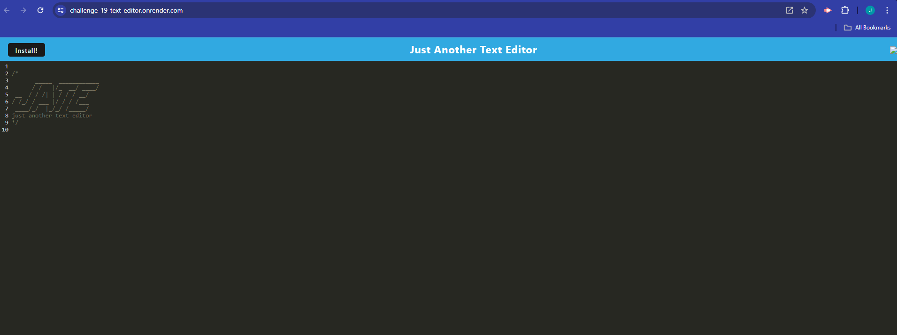

# challenge-19-text-editor

## Description

A text editor for you to create notes or code snippets with or without an internet connection

- Made for bootcamp challenge 19
- Created for PWA practice

## Table of Contents

- [Installation](#installation)
- [Usage](#usage)
- [Credits](#credits)
- [License](#license)

## Installation

N/A

## Usage

To use this application:

- Click this link to the app: https://challenge-19-text-editor.onrender.com/
- On your first visit, you will see this page:
  
- Click on any of the lines, and type!
- Whatever you type will be saved for the next time you use the application.
- To install the app to your desktop, click the 'install' button!

## Credits

- Starter code and some boiler plate code from bootcamp week 19 activities.
- Use of bootcamp Xpert learning assistant helped a lot with this challenge, but much of the code suggested had to be tweaked to work for this challenge.

## License

Please refer to the license in the repo
